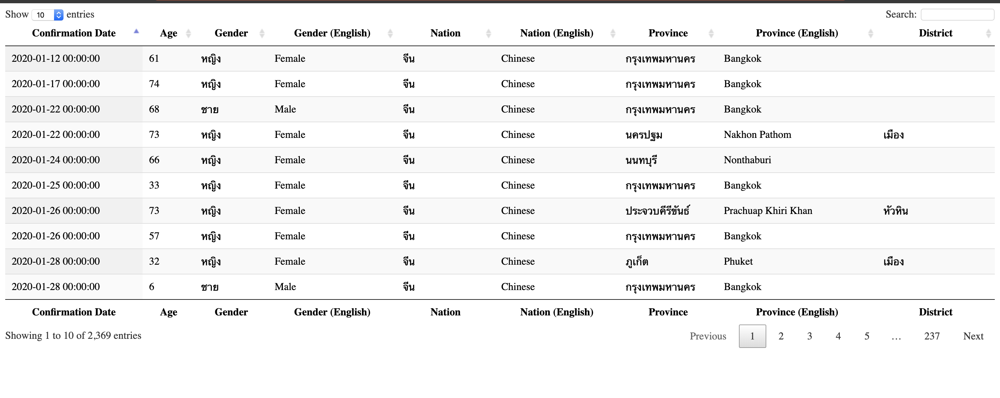

# COVID19 Regional Filter

This is a web based filter for cases of COVID-19 (currently in Thailand provinces only)

Primary app is at [https://covid19.omnidapps.com](https://covid19.omnidapps.com/).

## Roadmap

1.  Prettier UI
2.  Add more countries 
3.  Testing/Refactor

## Data Sources

#### Patient data :

- Official CDC tracking data: https://covid19.th-stat.com/api/open/cases 

#### Credits

- Awesome team at [covid19.th-stat.com](https://covid19.th-stat.com/)

## Issues

Submit an issue or feature request on this repository or contact the maintainers.

## Maintainers

- [Josh Santos](https://github.com/NerdsvilleCEO)

## Contributing
TBD
